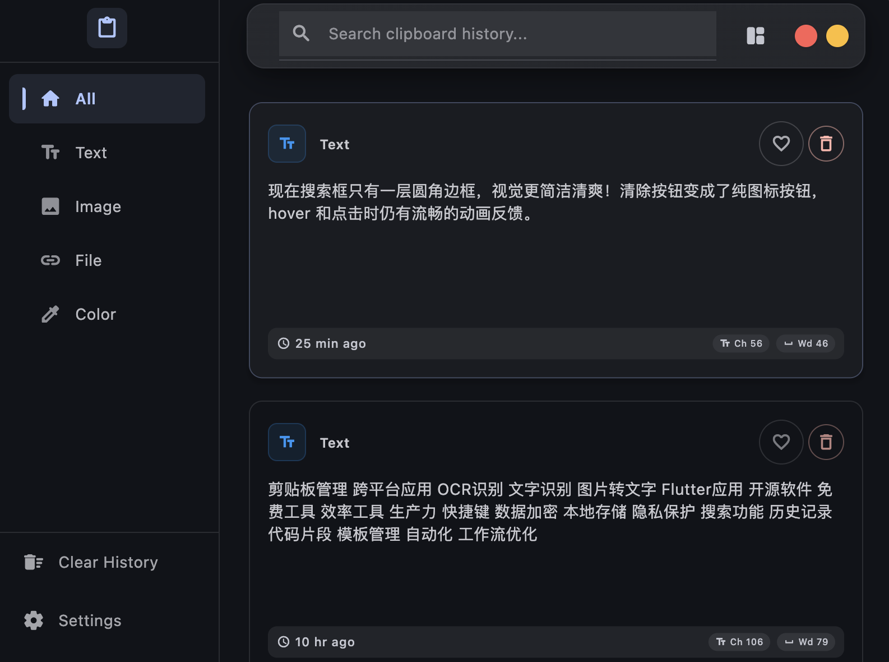

# ClipFlow — 跨平台剪贴板历史管理工具

<div class="project-meta">
  <span><b>角色</b>个人产品</span>
  <span><b>状态</b>macOS 已验证</span>
  <span><b>技术栈</b>Flutter · SQLite · 原生 OCR</span>
  <a href="https://github.com/jaronlu/clip_flow"><b>源码</b>GitHub ↗</a>
</div>

> 基于 Flutter 的桌面剪贴板工具，覆盖多格式识别、搜索、OCR、本地存储与双模式界面。



## 项目一句话

`ClipFlow` 把剪贴板历史从简单文本列表扩展为本地桌面工作台：识别文本、富文本、图片、代码、URL 和文件等内容，并通过搜索、收藏、OCR 与快捷键降低重复查找和粘贴成本。

## 为什么做这个项目

系统剪贴板通常只保留最近一次复制内容。开发、写作和资料整理过程中，代码片段、链接、图片与文件会频繁覆盖，重新定位原始内容会打断工作流。

这个项目重点解决三个问题：

- 不同剪贴板格式如何统一检测、归一化和持久化。
- 桌面应用如何兼顾完整管理界面与快速调用的紧凑界面。
- OCR、全局快捷键、托盘和窗口行为等平台能力如何收敛到统一的 Flutter 应用层。

## 核心能力

| 能力 | 工程落点 |
|---|---|
| 多格式识别 | Clipboard detector / processor 区分文本、富文本、代码、图片、颜色和文件等内容 |
| 双模式界面 | Classic 与 Compact 页面通过 Riverpod 状态和动画切换 |
| 搜索与整理 | 支持全文搜索、类型筛选、收藏、去重和历史数量限制 |
| OCR | 通过原生 MethodChannel 接入 macOS Vision、Windows Media OCR 与 Linux Tesseract 适配层 |
| 本地存储 | SQLite 持久化历史记录，并提供 AES-256-GCM 加解密服务 |
| 桌面集成 | 全局快捷键、系统托盘、开机启动、窗口监听与自动隐藏 |
| 国际化 | 中英文 ARB 资源与 Flutter 本地化生成流程 |

## 工程结构

```text
Flutter UI
  Classic / Compact / Settings
        ↓ Riverpod
Application Providers
        ↓
Clipboard / Search / OCR / Hotkey / Tray Services
        ↓
SQLite Storage / Platform Method Channels
```

项目将通用模型、平台能力、存储和可观测性放在 `lib/core/`，把经典模式、紧凑模式与设置页拆到 `lib/features/`，避免 UI 直接承担剪贴板监听和平台调用职责。

## 可验证证据

- GitHub 将 Dart 标记为主语言，`pubspec.yaml` 要求 Dart `^3.9.0`。
- OCR 三平台适配（macOS Vision / Windows Media OCR / Linux Tesseract）、AES-256-GCM 本地加密与全局快捷键均有对应源码实现，可在仓库中直接查证。
- `test/` 中的单元测试覆盖剪贴板检测、轮询、处理、去重、快捷键、OCR 与性能行为。
- 仓库包含 Classic、Compact、浅色模式与设置页的真实界面截图。
- 项目使用 MIT License。

## 技术取舍

| 选择 | 取舍 |
|---|---|
| Flutter 桌面端 | 复用 UI 与业务状态，但快捷键、OCR、托盘等能力仍需平台适配 |
| 轮询与异步处理队列 | 降低平台监听差异，代价是需要控制轮询开销和任务续排 |
| SQLite 本地存储 | 数据不依赖云端，适合剪贴板隐私场景，但跨设备同步不在当前范围 |
| AES-256-GCM | 每次加密使用随机 IV；当前密钥通过 SharedPreferences 持久化，不等同于系统 Keychain 级密钥保护 |
| 双界面模式 | 同时覆盖完整管理和快速选择，但需要保持两套交互状态一致 |

## 项目边界

- README 明确 macOS 已验证，Windows 与 Linux 仍待运行测试。
- Windows / Linux OCR 适配代码已经存在，不把“存在实现”表述为“完成跨平台验收”。
- GitHub 当前没有正式 Release，项目以源码构建和本地验证为主。
- 当前定位是个人桌面效率工具，不包含云同步、团队共享或移动端。

## 相关页面

- [项目总览](index.md)
- [关于](../about.md)


---

**联系**：对这个项目的设计取舍有想法，或在招相关方向 → [jr.lu.jobs@gmail.com](mailto:jr.lu.jobs@gmail.com) · [GitHub](https://github.com/jaronlu)
